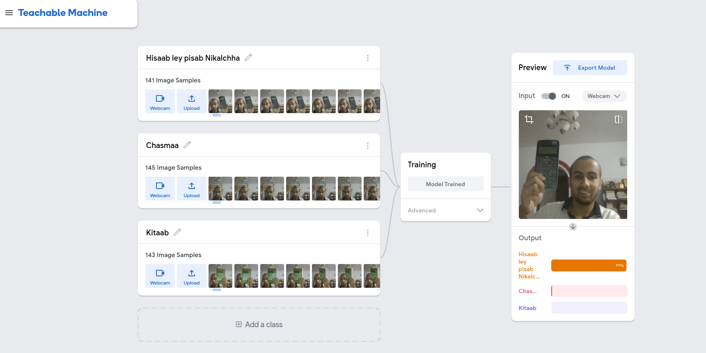

# SIMPLE REALTIME IMAGE CLASSIFIER

## Steps I followed

- Trained the model

This part was simple. I just captured sample images. It just took me 3 min for this process. https://teachablemachine.withgoogle.com

- Used p5js and ml5js library
- Created my sketch

## Model

Model I trained is publicly available
`https://teachablemachine.withgoogle.com/models/uLhMYDpLz/`

It can classify books, calculator and glass

Model can be changed to classify more

## Demo

- Glass demo with my sister
  

- Calculator demo
  

- Book demo

